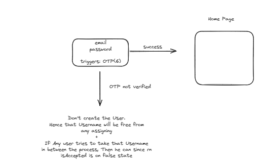
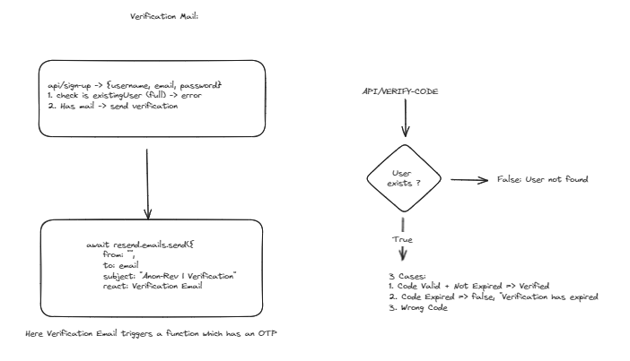

# Brief:

- Nextjs based fullstack projet aimed at Anonymous Review System
- User can signup + OTP verification. Then get's a page where he can generate his own link.
- New user can post Anonymous Review's onto that page

# Techstack

- Nextjs, Typescript
- MongoDb, Resend for mailing system
- Encrption by bcryptjs

# Home Page Signup Logic:

# New User Verification Flow:

# Verify Code Flow:

# Messages Structure

- Idea: User can accept messages and status
- API
  - POST: status update
  - GET: status of messages
  - GET: all messages of current logged in user (Aggregation Pipelining)
  - POST: send messages + save them
- Use session info and session id for the same
